<div align="center">

<!-- Animated underwater header — put this file at assets/header.svg in your kaivalya-cyber/kaivalya-cyber repo -->


<br/>


<br/>

[](https://www.linkedin.com/in/kaivalya-singh-732190374/)
[](https://instagram.com/kaivy_sngh)
[](https://kaivalyasinghportfolio.vercel.app/)
[](mailto:singh.kaivalya@gmail.com)


</div>

---

### `whoami`

```js
const kaivalya = {
  school     : "Evergreen Valley High School  ·  Class of 2028",
  orgs       : ["Founder @ Synthica (RL/ML Research)", "Founder @ Vantage Point Learning"],
  focus      : ["Quantum Computing", "Reinforcement Learning", "Computer Vision"],
  stack      : ["PyTorch", "PennyLane", "MuJoCo", "Gymnasium", "OpenCV"],
  building   : "Adaptive Variational QEC Decoder  +  MARL Drone Swarm Research",
};
```

I work at the intersection of quantum computing, reinforcement learning, and computer vision — shipping real research and production-grade systems, not toy demos. I lead **Synthica**, a student-run international research org, and founded **Vantage Point Learning**, a STEM nonprofit serving 400+ students across five schools.

<table>
<tr>
<td valign="top" width="50%">

**🔬 Research**
- Adaptive Variational QEC Decoder — CNN-routed syndrome decoder with 18.4% avg LER improvement, 27.2% peak
- Reward shaping for nonlinear control — novel **Lyapunov Satisfaction Rate (LSR)** metric, PPO/SAC/LQR baselines
- MARL Drone Swarm — CTDE architecture with emergent role specialization across two competing teams

</td>
<td valign="top" width="50%">

**⚙️ Engineering**
- **PureGrad** — autograd + backprop engine from scratch in NumPy, 99.7% acc, 19/19 tests
- **Drone Visual Tracking** — YOLOv8 + SAC agent deployed on real drone hardware via MAVSDK/PX4
- **FTC Analytics Dataset** — 53 events, 1,762 matches, OPR/ELO metrics, Kaggle published (88.69% acc)

</td>
</tr>
</table>

---

### `tech_stack`

<div align="center">

<!-- ML / RL -->


<!-- Quantum -->


<!-- Sim / Robotics -->


<!-- Systems -->


<!-- Web -->


</div>

---

### `featured`

<table>
<tr>
<td valign="top" width="50%">

**⚛️ Adaptive Variational QEC Decoder**<br/>
Real-time noise classifier routing syndrome data to specialized variational quantum decoders. 18.4% avg LER improvement, 94.2% classifier accuracy.<br/>
`PennyLane` `PyTorch` `stim` `pymatching`<br/>
[→ repo](https://github.com/kaivalya-cyber/variational-qec-decoder)

</td>
<td valign="top" width="50%">

**🤖 MAPPO Drone Swarm (MARL)**<br/>
Centralized Training Decentralized Execution swarm — two competing teams of three drones with emergent role specialization.<br/>
`PyTorch` `PyBullet` `Gymnasium`<br/>
[→ repo](https://github.com/kaivalya-cyber/drone_swarm_marl)

</td>
</tr>
<tr>
<td valign="top" width="50%">

**🧠 PureGrad — Autograd from Scratch**<br/>
Full deep learning framework in pure NumPy. Dynamic DAG, reverse-mode autodiff, MLP, optimizers. 99.7% acc, 19/19 tests.<br/>
`Python` `NumPy` `Autodiff`

</td>
<td valign="top" width="50%">

**🌐 Vantage Point Learning**<br/>
STEM nonprofit platform with real-time volunteer feed, atomic claim logic, Google OAuth/PKCE. Serving 400+ students across San Jose & Asia.<br/>
`React` `Supabase` `TypeScript`<br/>
[→ live](https://vantage-point-learning.lovable.app) · [→ repo](https://github.com/kaivalya-cyber/vantage-point-learning)

</td>
</tr>
</table>

---

### `github_stats`

<div align="center">


</div>

---

### `currently`

- ⚛️ Submitting QEC decoder paper to arXiv (cs.ET / quant-ph)
- 📐 Finalizing reward shaping research — LSR metric, chaotic RL benchmarking guidelines
- 🧭 Directing Synthica's next research sprint — sample efficiency, curriculum learning, meta-RL
- 🤖 Early contributions toward GSoC 2027 — ML4SCI, ArduPilot, OpenCV
- 🌐 Pursuing n8n Ambassador program

---

<div align="center">

*"Sometimes the best way to solve a problem is to help others." — Uncle Iroh*

<br/>


</div>
